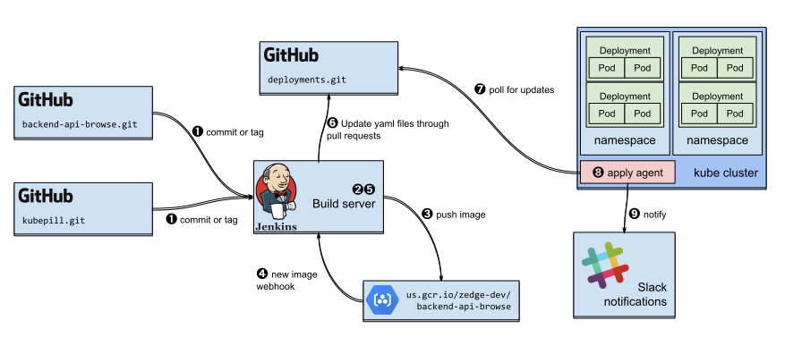

## Goals

KubeCD aims to provide the following:

1. A way to declare what should be running in a Kubernetes cluster using [GitOps](#gitops) principles, and
   tools to make it so.
1. A low-boilerplate continuous delivery mechanism for ops and developers, that:
   * ...is easy to getting started with, and is maintainable over time.
   * ...is agnostic of CI/build servers
   * ...allows for sharing properties among services in the same cluster/environment (such as external domain).
   * ...can be used for in-house as well as third-party services
1. Separation of (at least) test and production environments, with the option of separate access control
   per environment.
1. Multi-vendor support by design
   * adapt to certain aspects of each cloud vendor, but avoid locking to vendor-specific solutions without good reason

### Non-Goals and Limitations

* Provisioning clusters is not (currently) in scope. Input wanted.
* Kubernetes only
* Not aiming to support older Kubernetes versions (requiring 1.8 is reasonable)

## Overall Vision

A rough sketch of the desired development and deployment workflow:



➊ Developers work on individual repos (for example `example-app.git`), using pull requests, tags and so on.

❷ A build server assembles Docker images from these, and attaches the relevant Git metadata such as repository,
  branch, commit/tag and so on. The image needs to pass its tests before being pushed. Any build server could
  be used here in theory, allowing teams to choose what works best for them.

➌ The Docker image is pushed to a registry (`gcr.io/myproject/myrepo` here).

➍ A build server is notified of the newly pushed image (webhook or pubsub)
 
➎ A build for `deployments.git` is started, scans upgrade triggers for every release, bumps the image
  tag for deployments that want this image, and creates a PR for this change.

➏ PR is merged (either after being reviewed by a human, or automatically), and `deployments.git` master branch is
  updated with the new image tag.

➐ Within each cluster, a deployment agent regularly pulls `deployments.git`

➑ If changes are detected, deployments are re-applied

➒ Slack notification (or other chat service)

## Environments

An "environment" in this context is a namespace within a Kubernetes cluster.

A config file describes all of the reachable environments:

```yaml
environments:
  - name: test
    provider:
      gke:
        project: myproject
        clusterName: test-cluster
        zone: us-central1-b
    kubeNamespace: default
    releases:
      - ./base/releases.yaml
      - ./test/releases.yaml
    defaultValues:
      - key: "ingress.domain"
        value: "test.example.com"
  - name: prod
    provider:
      gke:
        project: myproject
        clusterName: prod-cluster
        zone: us-central1-b
    kubeNamespace: default
    releases:
      - ./base/releases.yaml
      - ./prod/releases.yaml
    defaultValues:
      - key: "ingress.domain"
        value: "prod.example.com"
```

Here, there are two environments, one in the default namespace of the `test-cluster` GKE cluster,
and the other in the default namespace of `prod-cluster`.

The `releases` field specifies a list of "releases files", which are parameterized Helm charts, and will be
explained below.

The `defaultValues` field specifies a list of Helm values that will be used for every chart/release
deployed into the environment. This can be used to simplify deploying the same charts in different
environments.

The full schema for this file can be found in the `KubeCDConfig` struct in
[`pkg/model/model.go`](pkg/model/model.go).

## Releases

The term "release" here is borrowed from Helm. Helm (somewhat confusingly) uses this term
to describe an [installation of a chart](https://github.com/kubernetes/helm/blob/master/docs/glossary.md#release)
with a release name and extra config values.

KubeCD builds on this concept by defining a "release" as a named Helm release along with its values.

In addition, KubeCD releases also have an [image upgrade trigger](#upgrade-triggers).

### Standardized Values

Helm's values files are not typed, so you can have any structure you want in there. However, if we
standardize a few values, a lot of opportunities become available.

KubeCD itself needs to know about two or three values to check for image

| Value name | Usage |
| --- | --- |
| `image.repository` | The image repository, which is Docker's term for the registry host plus "path" of the image, for example `gcr.io/project/image` |
| `image.tag` | The "tag" portion of the chart's main image, for example `2.0` |
| `image.prefix` | (Optional) if present, will be prepended to `image.repository`. This value is useful for cases where images in different environments reside in different Docker registries (such as with GCR and environments in different GCP projects) |

For sub-charts, the same pattern applies with the sub-chart name prefixed, for example
`zookeeper.image.repository`.

#### Semantic Versioning

KubeCD supports semantic versioning for images that follow it. In this case it will recognize tags using these
formats: `X`, `X.Y`, `X.Y.Z`, `vX`, `vX.Y`, `vX.Y.Z`. The `v` prefix is common enough with open source software to
justify making an exception for it.

### Examples

```yaml
resourceFiles:
  - storage-ssd.yaml

releases:

  - name: clickhouse
    chart:
      dir: ./charts/clickhouse
    values:
      - key: image.tag
        value: "1.1"

  - name: kafkaesque
    chart:
      dir: ./charts/kafkaesque
    triggers:
      - image:
          track: Newest
    
  - name: kafka
    chart:
      dir: ../charts/kafka
    valuesFile: ./kafka/values-prod.yaml
    values:
      - key: image.tag
        value: "4.0"
    triggers:
      - image:
          tagValue: "image.tag"
          repoValue: "image.repository"
          track: PatchLevel
      - image:
          tagValue: "zookeeper.image.tag"
          repoValue: "zookeeper.image.repository"
          track: PatchLevel
```

This file serves two roles: it has values to describe exactly which image should be
used for each release, and optionally a trigger for detecting new versions of the image.

It also has a list of `resourceFiles` which are straight Kubernetes resource files, with no fancy
substitutions or upgrade triggers happening. These are meant for simple stuff such as storage classes,
shared cluster roles and role bindings, shared config maps that are generated by other systems, and so on.
Currently, a caveat with resources created this way is that they won't be automatically removed if you remove
them from the release file. If this is a problem convert it to a Helm chart.

The three releases included in the example show some common ways of deploying charts: a chart locked to a
specific third-party image version (clickhouse), a chart tracking patch level updates to third-party images
(kafka) and finally a chart simply using the newest image available (kafkaesque). We'll go through the examples
below.

Let's go through each of the examples:

#### `clickhouse` release:

```yaml
  - name: clickhouse
    chart:
      dir: ./charts/clickhouse
    values:
      - key: image.tag
        value: "1.1"
```

This is a very simple release that sets the `image.tag` value but does not attempt to track image
updates.

#### `kafkaesque` release:

```yaml
  - name: kafkaesque
    chart:
      dir: ./charts/kafkaesque
    values:
      - key: image.repository
        value: "gcr.io/myproject/kafkaesque"
      - key: image.tag
        value: "v1.0.5"
    triggers:
      - image:
          track: Newest
```

Again, we apply a chart from a local directory, but now there'a also an upgrade trigger. More on upgrade triggers
[below](#upgrade-triggers).

#### `nginx-ingress` release:

```yaml
  - name: ingress
    chart:
      reference: stable/nginx-ingress
      version: 0.9.5
    values:
      - key: controller.service.loadBalancerIP
        valueFrom:
          gceResource:
            address:
              name: test-ingress
              isGlobal: false
```

This example shows how to use public charts from official repos. KubeCD calls these "chart references"
because some Helm documentation uses that term. For reproducibility, it's important to pin the chart version,
so the `version` field needs to be required for chart references.

Another feature shown off in this example is how to fill in data from the underlying infrastructure. Here, we
set the `controller.service.loadBalancerIP` value to the IP address of the assumed-to-be-preallocated Google Compute
Engine IP address named `test-ingress` in the same project/region as the environment/cluster.
(If `isGlobal` had been `true`, it would be using a global (anycast) IP, not a regional one.)

### Upgrade Triggers

An upgrade trigger describes a means to react to events like a new image tag. Each release may specify
which repositories to watch for tags, and which tags should be considered.

Triggers are not used while deploying a release, instead they declare how the system should look for
new versions during an upgrade check, and which versions this release wants to subscribe to.

This can be just informative for engineers, but the idea is that an automated update of the tag value happens,
as shown in ➎ in [the architecture diagram](#overall-vision) section.

For example:

```yaml
    values:
      - key: "image"
        value: "mysql"
      - key: "imageTag"
        value: "5.7.14"
    triggers:
      - image:
          repoValue: "image"
          tagValue: "imageTag"
          track: PatchLevel
```

Here, the upgrade trigger will kick in for patch level updates within the same major.minor version.
In other words, if a `5.7.15` tag is found for the image, this is considered an upgrade, but a `5.8.0` tag
is not.

The supported values for `track:` are:

 * `PatchLevel` - upgrade on patch level updates only
 * `MinorVersion` - upgrade on minor version or patch level updates
 * `MajorVersion` - upgrade on minor, major or patch level version updates
 * `Newest` - upgrade to whatever is the newest (as in most recently created) tag

The `repoValue` and `tagValue` fields refer to the Helm values containing the image repository and tag
respectively. If omitted, these default to `"image.repository"` and `"image.tag"`, which are the standard
KubeCD values.

It is possible to watch for updates in more than one image. This can be useful if a chart consists of multiple
workloads, as seen in the `kafka` example above.

#### Auto Upgrades

KubeCD can be hooked up with registry webhooks (or Google Cloud PubSub for GCR) to automatically
discover new image tags and patch releases.

Auto-patching is done in a way that preserves comments and field
order, but may reindent the yaml. To prevent noisy whitespace changes
in upgrade commits, canonically indent files with `kcd indent` and
commit whitespace-only changes.


## References

### GitOps

"GitOps" is a newer coinage of the concept "infrastructure as code"
that has been popularized lately especially by WeaveWorks. It
describes operation of server-side infrastructure using Git as the
source of truth. This way one can re-use existing tools for version
control, history, reviews, rollbacks and so on.

Some references:

 * [WeaveWorks Blog](https://www.weave.works/blog/gitops-operations-by-pull-request)
 * [KubeCon 2017 keynote by Kelsey Hightower](https://www.youtube.com/watch?v=07jq-5VbBVQ)

### Helm

[Helm](https://helm.sh) is the standard Kubernetes "package
manager". It can be used to package multiple related resources in a
single "chart", with a parameterization layer and support for running
multiple instances of the same package in a cluster.

Helm uses
[go templates](https://github.com/kubernetes/helm/blob/master/docs/charts.md#templates-and-values)
on top of Kubernetes YAML resource files. Using templates with a
whitespace-sensitive format like YAML can be tricky, and something
we should not burden every developer to have to deal with.

Helm's general solution to this is to offer "values" that the user can
customize, through an arbitrary YAML schema defined in each chart's
"values file".

### Other Tools / References

 * https://github.com/weaveworks/flux
 * https://coreos.com/blog/introducing-operators.html
 * https://github.com/GoogleCloudPlatform/skaffold
 * https://github.com/GoogleCloudPlatform/continuous-deployment-on-kubernetes
 * https://github.com/kelseyhightower/pipeline
